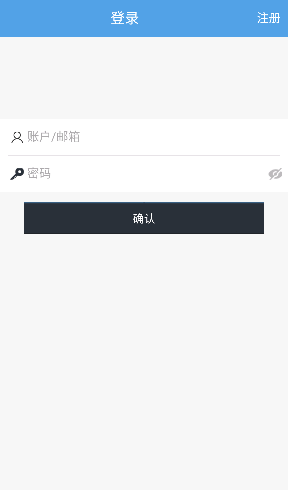

# healthy
A mobile app based on ReactNative
#### 简介：健康问题问答APP，含注册，登录。

### Build Setup

``` bash
node -v 7.9.0
#Install
git clone https://github.com/FantasyGao/healthy.git

# Run
cd healthy && $ react-native run-android （前提有ReactNative应用运行的环境）
```
运行效果





